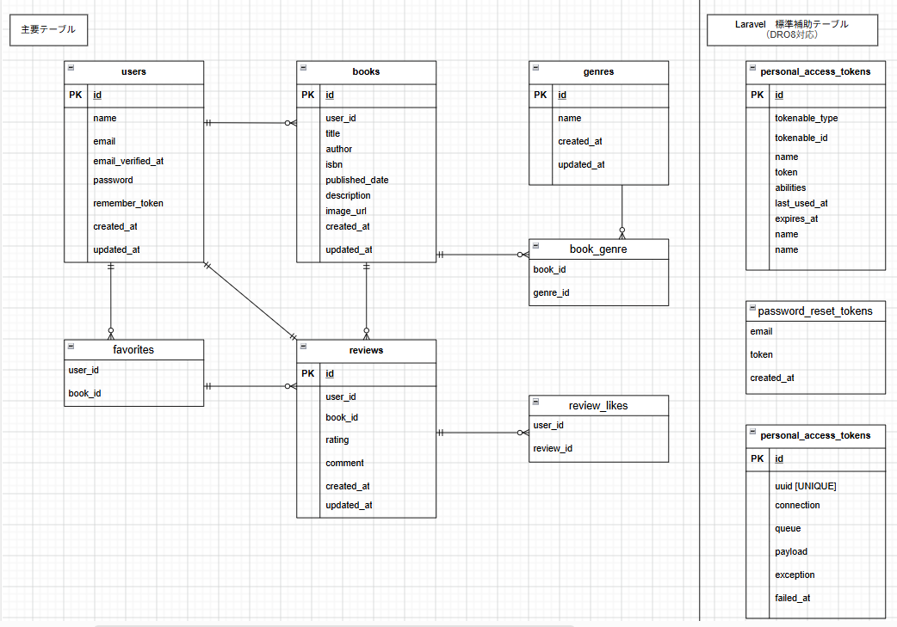

# Bookshelf App

Bookshelf Appは、書籍の登録・レビュー・お気に入り・レビューいいね・ジャンル管理・ランキング・公開APIを備えた、Laravelによる書籍レビューアプリケーションです。

単に機能を実装するだけではなく、以下を意識して設計しています。

- Controllerの責務を小さくする
- 認証・認可・バリデーションの責務を分離する
- データベース制約によってデータ整合性を保証する
- Eloquentのリレーションを活用する
- N+1問題を避ける
- Feature Test・Unit Testによって仕様やModel設計を回帰テストとして固定する
- Laravel標準の仕組みを活用し、保守しやすい構造にする

---

## 1. アプリケーション概要

ユーザーが書籍を登録し、書籍に対してレビューやお気に入り登録を行うことができます。

また、レビューへのいいね、ジャンルによる書籍分類、レビュー平均評価によるランキングを実装しています。

Web画面とは別に、書籍情報を操作するPublic APIも実装しています。

### 主な機能

- 会員登録
- ログイン
- ログアウト
- 書籍一覧
- 書籍詳細
- 書籍登録
- 書籍編集
- 書籍削除
- レビュー投稿
- レビュー編集
- レビュー削除
- お気に入り登録・解除
- お気に入り一覧
- レビューいいね登録・解除
- ジャンル登録
- ジャンル一覧
- ジャンル詳細
- ジャンル編集
- ジャンル削除
- 書籍ランキング
- Public Book API

---

## 2. 開発目的

本アプリケーションでは、Laravelを利用したWebアプリケーション開発に必要となる以下の要素を一通り実装することを目的としています。

- MVC
- 認証
- 認可
- バリデーション
- Eloquent ORM
- 1対多・多対多リレーション
- 外部キー制約
- API
- Feature Test
- Unit Test
- コード品質管理

特に、Controllerへすべての処理を記述するのではなく、Laravelが提供する仕組みを利用して責務を適切に分離することを意識しています。

---

## 3. 使用技術

| 項目 | バージョン・用途 |
| --- | --- |
| PHP | 8.2.33 |
| Laravel | 10.50.2 |
| MySQL | 8.4 |
| Laravel Sail | Docker開発環境 |
| Laravel Fortify | 認証処理 |
| Laravel Sanctum | Personal Access Token |
| Blade | Web画面 |
| Eloquent ORM | DBアクセス・リレーション |
| FormRequest | バリデーション |
| Policy | 認可 |
| API Resource | APIレスポンス整形 |
| PHPUnit | 自動テスト |
| Laravel Pint | コードスタイル統一 |
| phpMyAdmin | DB確認 |
| Docker | 開発環境のコンテナ化 |

---

## 4. 開発環境

Laravel Sailを利用し、Docker上にPHP・MySQL・Laravelアプリケーションの実行環境を構築しています。

```text
Windows 11
  └─ WSL2 Ubuntu
       └─ Docker
            ├─ Laravel / PHP 8.2
            ├─ MySQL 8.4
            └─ phpMyAdmin
```

### Laravel Sail / Dockerを採用した理由

ローカルPCへPHPやMySQLを直接インストールする構成では、開発環境ごとの差異によって動作結果が変わる可能性があります。

Laravel SailとDockerを利用することで、以下を目的としています。

- PHPバージョンの統一
- MySQLバージョンの統一
- 開発環境の再現性確保
- ホストOSへの依存軽減
- 環境構築手順の統一

---

## 5. 環境構築

### 1. リポジトリをClone

```bash
git clone https://github.com/simanuki0923/bookshelf-app.git
cd bookshelf-app
```

### 2. Composerパッケージをインストール

```bash
composer install
```

### 3. 環境変数ファイルを作成

```bash
cp .env.example .env
```

`.env` のDatabase設定を環境に合わせて設定します。

例：

```env
DB_CONNECTION=mysql
DB_HOST=mysql
DB_PORT=3306
DB_DATABASE=<DATABASE_NAME>
DB_USERNAME=<DATABASE_USER>
DB_PASSWORD=<DATABASE_PASSWORD>
```

### 4. Laravel Sailを起動

```bash
./vendor/bin/sail up -d
```

`sail` をalias登録している場合は、以下でも実行できます。

```bash
sail up -d
```

### 5. APP_KEYを生成

```bash
sail artisan key:generate
```

### 6. Migrationを実行

```bash
sail artisan migrate
```

### 7. Seederを実行

```bash
sail artisan db:seed
```

Databaseを初期化してSeederまで実行する場合は以下を使用します。

```bash
sail artisan migrate:fresh --seed
```

### アプリケーション

```text
http://localhost
```

### phpMyAdmin

```text
http://localhost:8080
```

---

## 6. データベース構成

本アプリケーションでは、アプリケーションの主要データを管理する7テーブルと、Laravel標準の補助テーブル3テーブルを使用しています。

### 主要テーブル

```text
users
books
genres
book_genre
reviews
favorites
review_likes
```

### Laravel標準補助テーブル（DR08）

```text
password_reset_tokens
personal_access_tokens
failed_jobs
```

DR08の基本要件に基づき、Laravel標準Migrationで作成される以下の3テーブルはDatabase上に保持しています。

#### password_reset_tokens

パスワードリセット用トークンを管理するLaravel標準テーブルです。

#### personal_access_tokens

Laravel SanctumのPersonal Access Tokenを管理するLaravel標準テーブルです。

#### failed_jobs

Queue処理に失敗したJob情報を管理するLaravel標準テーブルです。

### usersテーブルの2FA関連カラム

Laravel Fortifyの標準Migrationでは、usersテーブルに以下のカラムが追加されます。

```text
two_factor_secret
two_factor_recovery_codes
two_factor_confirmed_at
```

本アプリケーションのBasic版では、

```text
会員登録
ログイン
ログアウト
```

のみを認証機能として使用し、2要素認証機能は使用しません。

そのため、上記3カラムは後続Migrationによって削除し、最終的なusersテーブルには含めない設計としています。

---

## 7. ER図

本アプリケーションのDatabase構成は以下のER図の通りです。



ER図の編集元はリポジトリ直下の `ER.drawio` です。

### 主要なリレーション

```text
users 1 : N books

users 1 : N reviews

books 1 : N reviews

books N : N genres
  └─ book_genre

users N : N books
  └─ favorites

users N : N reviews
  └─ review_likes
```

### Laravel標準補助テーブル

`personal_access_tokens` は、

```text
tokenable_type
tokenable_id
```

によるポリモーフィック関連を利用しています。

`password_reset_tokens` と `failed_jobs` は、主要7テーブルとは直接リレーションを持たないLaravel標準補助テーブルです。

---

## 8. テーブル仕様

### users

ユーザー情報を管理します。

| カラム | 型 | 制約・内容 |
| --- | --- | --- |
| id | bigint unsigned | PRIMARY KEY |
| name | varchar(255) | NOT NULL |
| email | varchar(255) | NOT NULL / UNIQUE |
| email_verified_at | timestamp | NULL許可 |
| password | varchar(255) | NOT NULL |
| remember_token | varchar(100) | NULL許可 |
| created_at | timestamp | Laravel timestamps |
| updated_at | timestamp | Laravel timestamps |

`email` にはUNIQUE制約を設定しています。

本アプリケーションでは2要素認証を使用しないため、

```text
two_factor_secret
two_factor_recovery_codes
two_factor_confirmed_at
```

は最終的なusersテーブルには保持しません。

---

### books

登録された書籍情報を管理します。

| カラム | 型 | 制約・内容 |
| --- | --- | --- |
| id | bigint unsigned | PRIMARY KEY |
| user_id | bigint unsigned | NOT NULL / FOREIGN KEY → users.id |
| title | varchar(255) | NOT NULL |
| author | varchar(255) | NOT NULL |
| isbn | char(13) | NOT NULL / UNIQUE |
| published_date | date | NOT NULL |
| description | text | NULL許可 |
| image_url | varchar(255) | NULL許可 |
| created_at | timestamp | Laravel timestamps |
| updated_at | timestamp | Laravel timestamps |

`user_id` は書籍を登録したユーザーを表します。

ユーザー削除時には、そのユーザーが登録した書籍も削除されるよう外部キーへCascade Deleteを設定しています。

ISBNは13桁とし、重複登録を防止するため `isbn` にUNIQUE制約を設定しています。

---

### genres

書籍を分類するジャンルを管理します。

| カラム | 型 | 制約・内容 |
| --- | --- | --- |
| id | bigint unsigned | PRIMARY KEY |
| name | varchar(255) | NOT NULL / UNIQUE |
| created_at | timestamp | Laravel timestamps |
| updated_at | timestamp | Laravel timestamps |

同一ジャンル名の重複登録を防止するため、`name` にUNIQUE制約を設定しています。

---

### book_genre

BookとGenreの多対多関係を管理する中間テーブルです。

| カラム | 型 | 制約・内容 |
| --- | --- | --- |
| book_id | bigint unsigned | PRIMARY KEY（複合） / FOREIGN KEY → books.id |
| genre_id | bigint unsigned | PRIMARY KEY（複合） / FOREIGN KEY → genres.id |

```text
book_id + genre_id
```

を複合主キーとしています。

これにより、同一書籍へ同じジャンルが重複して登録されることをDatabaseレベルで防止しています。

`book_id` はBook削除時に関連を削除するためCascade Delete、`genre_id` は利用中Genreの削除を防ぐためRestrict Deleteとしています。

---

### reviews

書籍へ投稿されたレビューを管理します。

| カラム | 型 | 制約・内容 |
| --- | --- | --- |
| id | bigint unsigned | PRIMARY KEY |
| user_id | bigint unsigned | NOT NULL / FOREIGN KEY → users.id |
| book_id | bigint unsigned | NOT NULL / FOREIGN KEY → books.id |
| rating | tinyint unsigned | NOT NULL / 1〜5 |
| comment | text | NOT NULL |
| created_at | timestamp | Laravel timestamps |
| updated_at | timestamp | Laravel timestamps |

`rating` は1〜5の範囲で必須です。

`comment` も必須とし、Validationでは最大1000文字としています。

`reviews` では、

```text
user_id + book_id
```

にUNIQUE制約を設定していません。

これは、同一ユーザーが同一書籍へ複数回レビューを投稿できる仕様に対応するためです。

`user_id` と `book_id` はともにCascade Deleteとしています。

---

### favorites

ユーザーのお気に入り書籍を管理する中間テーブルです。

| カラム | 型 | 制約・内容 |
| --- | --- | --- |
| user_id | bigint unsigned | PRIMARY KEY（複合） / FOREIGN KEY → users.id |
| book_id | bigint unsigned | PRIMARY KEY（複合） / FOREIGN KEY → books.id |

```text
user_id + book_id
```

を複合主キーとしています。

これにより、同一ユーザーによる同一書籍への重複お気に入り登録をDatabaseレベルで防止しています。

両方の外部キーにCascade Deleteを設定しています。

---

### review_likes

レビューに対するいいねを管理する中間テーブルです。

| カラム | 型 | 制約・内容 |
| --- | --- | --- |
| user_id | bigint unsigned | PRIMARY KEY（複合） / FOREIGN KEY → users.id |
| review_id | bigint unsigned | PRIMARY KEY（複合） / FOREIGN KEY → reviews.id |

```text
user_id + review_id
```

を複合主キーとしています。

これにより、同一ユーザーによる同一レビューへの重複いいねをDatabaseレベルで防止しています。

両方の外部キーにCascade Deleteを設定しています。

---

### password_reset_tokens

Laravel標準のパスワードリセット用補助テーブルです。

| カラム | 型 | 制約・内容 |
| --- | --- | --- |
| email | varchar(255) | PRIMARY KEY |
| token | varchar(255) | NOT NULL |
| created_at | timestamp | NULL許可 |

Basic版ではパスワードリセット機能自体は提供していませんが、DR08の基本要件としてLaravel標準Migrationの構成を保持しています。

---

### personal_access_tokens

Laravel SanctumがPersonal Access Tokenを管理するための標準テーブルです。

| カラム | 型 | 制約・内容 |
| --- | --- | --- |
| id | bigint unsigned | PRIMARY KEY |
| tokenable_type | varchar(255) | NOT NULL / INDEX |
| tokenable_id | bigint unsigned | NOT NULL / INDEX |
| name | varchar(255) | NOT NULL |
| token | varchar(64) | NOT NULL / UNIQUE |
| abilities | text | NULL許可 |
| last_used_at | timestamp | NULL許可 |
| expires_at | timestamp | NULL許可 |
| created_at | timestamp | Laravel timestamps |
| updated_at | timestamp | Laravel timestamps |

`tokenable_type` と `tokenable_id` によるポリモーフィック関連を利用しています。

`User` モデルではLaravel Sanctumの `HasApiTokens` Traitを使用しています。

---

### failed_jobs

Laravel Queueで処理に失敗したJobを記録する標準補助テーブルです。

| カラム | 型 | 制約・内容 |
| --- | --- | --- |
| id | bigint unsigned | PRIMARY KEY |
| uuid | varchar(255) | NOT NULL / UNIQUE |
| connection | text | NOT NULL |
| queue | text | NOT NULL |
| payload | longtext | NOT NULL |
| exception | longtext | NOT NULL |
| failed_at | timestamp | NOT NULL / CURRENT_TIMESTAMP |

現在のアプリケーション機能から直接利用しているテーブルではありませんが、DR08の基本要件としてLaravel標準Migrationの構成を保持しています。

---

## 9. Eloquentリレーション設計

モデル間の関連はEloquent ORMで定義しています。

### User

```text
User
├─ hasMany Books
├─ hasMany Reviews
├─ belongsToMany FavoriteBooks
└─ belongsToMany LikedReviews
```

### Book

```text
Book
├─ belongsTo User
├─ belongsToMany Genres
├─ hasMany Reviews
└─ belongsToMany FavoritedByUsers
```

### Genre

```text
Genre
└─ belongsToMany Books
```

### Review

```text
Review
├─ belongsTo User
├─ belongsTo Book
└─ belongsToMany LikedByUsers
```

### personal_access_tokens

`personal_access_tokens` は通常の外部キーによる関連ではなく、

```text
tokenable_type
tokenable_id
```

によるポリモーフィック関連を使用します。

UserモデルではLaravel Sanctumの `HasApiTokens` Traitを使用しています。

### password_reset_tokens / failed_jobs

以下の2テーブルについては、主要ModelとのEloquentリレーションを定義していません。

```text
password_reset_tokens
failed_jobs
```

Laravel標準機能を支える補助テーブルとして管理しています。

### Eloquentを採用した理由

ControllerでSQLやJOINを直接記述するのではなく、Modelへリレーションを定義することで以下を目的としています。

- データ構造をModelから把握しやすくする
- ControllerのDB処理を簡潔にする
- Laravel標準の記述方法へ統一する
- 関連データ取得を再利用しやすくする
- モデル間の責務を明確にする

---

## 10. 認証・認可設計

### 認証

認証にはLaravel Fortifyを使用しています。

Basic機能として以下を実装しています。

- 会員登録
- ログイン
- ログアウト

Fortifyの追加機能であるパスワードリセット・メール認証・2要素認証などは、Basic版では使用していません。

### Fortifyを採用した理由

認証を独自実装すると、Password Hash、Session、CSRF、ログイン状態など、多くのセキュリティ要素を個別に考慮する必要があります。

Laravel Fortifyを利用することで、Laravel標準の認証機構を使用しつつ、Bladeによる画面表示と認証処理の責務を分離しています。

これにより、認証処理の安全性・保守性を高めています。

### 認可

書籍とレビューの編集・削除にはLaravel Policyを使用しています。

```text
BookPolicy
ReviewPolicy
```

#### BookPolicy

書籍の編集・削除は、書籍登録者本人のみ許可します。

権限のないユーザーによる操作にはHTTP 403を返します。

#### ReviewPolicy

レビューの編集・削除は、レビュー投稿者本人のみ許可します。

権限のないユーザーによる操作にはHTTP 403を返します。

### Policyを採用した理由

Controllerへ以下のような認可判定を繰り返し記述すると、Controllerの責務が増え、認可処理が複数箇所へ分散します。

```php
if ($book->user_id !== auth()->id()) {
    abort(403);
}
```

Policyへ認可処理を分離することで、以下を目的としています。

- Controllerを簡潔に保つ
- 認可ルールを一箇所へ集約する
- 認可仕様変更時の修正範囲を減らす
- 不正な編集・削除を防止する

---

## 11. バリデーション設計

入力値のValidationにはLaravel FormRequestを使用しています。

主なRequestクラスは以下です。

```text
StoreBookRequest
UpdateBookRequest
StoreReviewRequest
UpdateReviewRequest
StoreGenreRequest
UpdateGenreRequest
Auth/LoginRequest

Api/V1/ListBooksRequest
Api/V1/StoreBookRequest
Api/V1/UpdateBookRequest
```

Validation Errorのメッセージは日本語で表示します。

### 書籍

主なValidationは以下です。

```text
title
required / string / max:255

author
required / string / max:255

isbn
required / digits:13 / unique

published_date
required / date

description
nullable / string

image_url
nullable / url / max:255

genres
required / array / min:1
```

ISBNはハイフンなしの13桁で検証します。

`genres` 配列については、同一Genre IDの重複自体はValidation Errorとはしません。

### レビュー

```text
rating
required / integer / min:1 / max:5

comment
required / string / max:1000
```

### ジャンル

```text
name
required / string / max:255 / unique
```

更新時は現在のジャンル自身をUNIQUE判定から除外します。

### API書籍一覧

```text
keyword
nullable / string / max:255

genre_id
nullable / integer / exists:genres,id

page
nullable / integer / min:1

per_page
nullable / integer / min:1 / max:100
```

### FormRequestを採用した理由

Controller内へValidationを直接記述すると、

```text
認可
Validation
DB更新
画面遷移
```

など複数の責務がControllerへ集中します。

ValidationをFormRequestへ分離することで、Controllerを処理の組み立てとレスポンス制御へ集中させています。

---

## 12. 各機能の設計背景

### 書籍機能

書籍には登録ユーザーを示す `user_id` を保持しています。

```text
登録ユーザー本人
├─ 編集可能
└─ 削除可能

その他のユーザー
├─ 編集不可
└─ 削除不可
```

書籍一覧は新しい書籍から表示し、10件単位でPaginationしています。

---

### レビュー機能

レビューには以下を保持しています。

```text
user_id
book_id
rating
comment
```

`rating` は1〜5、`comment` は必須です。

同一ユーザーが同一書籍へ複数レビューを投稿できる仕様のため、

```text
user_id + book_id
```

にはUNIQUE制約を設定していません。

また、書籍登録者本人が自分で登録した書籍へレビューを投稿することも可能です。

#### この設計を採用した理由

レビューを「ユーザーと書籍の関係を1件だけ保存するデータ」ではなく、「ある時点でユーザーが投稿した評価データ」として扱っています。

そのため、同じ書籍を再読した際などにも新しいレビューを投稿できます。

---

### お気に入り機能

ユーザーと書籍は多対多関係になるため、`favorites` 中間テーブルを利用しています。

`user_id + book_id` を複合主キーにすることで、Application側だけでなくDatabase側でも重複登録を防止しています。

ユーザーは、自分自身が登録した書籍もお気に入り登録できます。

お気に入り一覧はBookの `created_at` の降順で表示します。

---

### レビューいいね機能

レビューいいねには `review_likes` 中間テーブルを使用しています。

```text
User
  ↓
review_likes
  ↓
Review
```

登録・解除にはEloquentの `toggle()` を利用しています。

```text
未登録
  ↓
いいね登録

登録済み
  ↓
いいね解除
```

同一エンドポイントで登録と解除を切り替えられる構造です。

#### 自分のレビューへのいいね

レビュー投稿者本人も自分のレビューへいいねできます。

レビュー投稿者とレビューへいいねするユーザーを別の役割として扱っているため、

```text
review.user_id === login user
```

による制限を設けていません。

---

### ジャンル機能

BookとGenreは多対多関係です。

```text
Book
  ↓
book_genre
  ↓
Genre
```

これにより、

```text
1冊の書籍 → 複数ジャンル

1ジャンル → 複数書籍
```

を表現しています。

書籍から利用されているGenreは削除できないよう制御しています。

利用中のGenreを削除しようとした場合は、

```text
このジャンルには書籍が紐付いているため削除できません。
```

と表示します。

ジャンル一覧はジャンル名順、ジャンル別書籍一覧はBookの `created_at` の降順で表示します。

---

### ランキング機能

レビュー平均評価が高い書籍から順番に最大10件表示します。

レビューが存在しない書籍はランキング対象外です。

ランキングの主な並び順はレビュー平均評価の降順です。

平均評価やレビュー件数にはEloquentの以下の集計機能を利用しています。

```text
withAvg()
withCount()
```

PHP側ですべてのReviewを取得して計算するのではなく、Database側で集計することで不要なデータ取得を減らしています。

---

## 13. データ整合性設計

外部キー制約とCascade / Restrictを利用し、削除処理後に不整合データが残らないよう設計しています。

### Book削除時

```text
Book
├─ Reviews      → 削除
├─ Favorites    → 削除
├─ book_genre   → 関連削除
└─ Genres       → 削除しない
```

### Review削除時

```text
Review
└─ ReviewLikes → 削除
```

### cascadeOnDeleteを採用した理由

例えば書籍削除後にその書籍を参照するReviewが残ると、存在しない書籍IDを参照する孤立データになります。

書籍に依存して存在するデータには `cascadeOnDelete()` を設定し、親データ削除時に関連データも削除されるようにしています。

### Genreを削除しない理由

Genreは特定の書籍専用のデータではなく、複数の書籍から共有されるマスタデータです。

そのためBook削除時にはGenre本体を削除せず、`book_genre` の関連だけを削除します。

また、利用中Genreの誤削除を防ぐため、`book_genre.genre_id` 側には削除制限を設定しています。

### 中間テーブルの複合主キー

以下の中間テーブルでは、2つの外部キーを複合主キーとしています。

```text
book_genre
  book_id + genre_id

favorites
  user_id + book_id

review_likes
  user_id + review_id
```

Application側の処理だけに依存せず、Database側でも同一組み合わせの重複登録を防止しています。

---

## 14. パフォーマンス設計

### N+1問題への対応

関連データを表示する処理ではEager Loadingを利用しています。

BookごとにGenreやReviewを個別取得すると、Book件数に応じてSQL発行回数が増加するN+1問題が発生します。

そのため、以下を利用しています。

```text
with()
load()
withAvg()
withCount()
```

必要な関連情報を事前にまとめて取得することで、SQL発行回数を抑えています。

### Pagination

以下の一覧では10件単位のPaginationを使用しています。

- 書籍一覧
- お気に入り一覧
- ジャンル別書籍一覧

Public APIの書籍一覧は、

```text
default per_page = 20
max per_page = 100
```

としています。

全件を一度に取得せず表示件数を制限することで、データ量増加時のDB取得量・メモリ使用量・HTML描画量の増加を抑えることを目的としています。

---

## 15. Public API

Web画面とは別にBook情報を扱うPublic APIを実装しています。

Basic版のAPIは認証不要です。

### エンドポイント

| Method | URI | 内容 | 認証 |
| --- | --- | --- | --- |
| GET | `/api/v1/books` | 書籍一覧 | 不要 |
| POST | `/api/v1/books` | 書籍登録 | 不要 |
| GET | `/api/v1/books/{book}` | 書籍詳細 | 不要 |
| PUT | `/api/v1/books/{book}` | 書籍更新 | 不要 |
| DELETE | `/api/v1/books/{book}` | 書籍削除 | 不要 |

### 一覧検索パラメータ

| パラメータ | 内容 |
| --- | --- |
| keyword | title / author 部分一致検索 |
| genre_id | Genre IDによる絞り込み |
| page | ページ番号 |
| per_page | 1ページあたりの件数 |

`per_page` の標準値は20、最大100です。

書籍一覧は `created_at DESC` の最新順で取得します。

範囲外のページ番号を指定した場合もLaravel標準Paginationの形式で、

```text
HTTP 200
data: []
links: ...
meta: ...
```

を返します。

### 書籍登録時のuser_id

Public APIはBasic版では認証を使用しないため、書籍登録時の登録ユーザーはRequestから受け取る `user_id` によって指定します。

### API Controllerを分離した理由

Web用ControllerとAPI用Controllerでは返却する内容が異なります。

```text
Web
→ Blade View

API
→ JSON
```

そのため、API Controllerを以下へ分離しています。

```text
App\Http\Controllers\Api\V1
```

### V1名前空間を採用した理由

将来的にAPI仕様変更が発生した場合でも、

```text
/api/v1/
/api/v2/
```

のようにVersionを分離できる構成にするためです。

---

## 16. API Resource

APIレスポンスにはLaravel API Resourceを使用しています。

```text
BookResource
ReviewResource
```

### BookResource

基本レスポンスでは以下を返します。

```text
id
title
author
isbn
published_date
description
image_url
genres
average_rating
review_count
```

`user_id`、`created_at`、`updated_at` はPublic APIのBookResourceには含めません。

書籍詳細では、上記に加えて `reviews` を返します。

レビューが存在しない場合、

```json
{
    "average_rating": null
}
```

のように `average_rating` は `null` を返します。

平均評価が存在する場合は小数第1位まで返します。

### ReviewResource

書籍詳細のレビューには主に以下を返します。

```text
id
user_name
rating
comment
created_at
```

### API Resourceを採用した理由

Eloquent ModelをそのままJSONとして返すと、Database内部構造とAPI仕様が強く結合します。

API Resourceを利用することで、

- APIとして公開する項目を明確にする
- Model変更によるAPIへの影響を減らす
- JSON構造を統一する
- APIレスポンス生成をControllerから分離する

ことを目的としています。

---

## 17. APIレスポンス

主なHTTP Statusは以下です。

```text
GET     200 OK
POST    201 Created
PUT     200 OK
DELETE  204 No Content
```

存在しないBookの場合は404を返します。

APIの404レスポンスは以下の形式です。

```json
{
    "error": "書籍が見つかりませんでした。"
}
```

Validation Errorの場合はLaravel標準形式で422を返します。

```json
{
    "message": "...",
    "errors": {
        "field": [
            "..."
        ]
    }
}
```

---

## 18. Controllerの責務

本アプリケーションでは以下のように責務を分離しています。

```text
Controller
→ 処理の組み立て・レスポンス

FormRequest
→ Validation

Policy
→ Authorization

Model
→ Relation / Data Access

API Resource
→ API Response
```

Controllerへ処理を集中させず、それぞれの役割をLaravelの標準機能へ分離することで保守しやすい構成を目指しています。

---

## 19. テスト方針

本アプリケーションでは、Feature TestとModelのUnit Testを実装しています。

Feature Testでは、単純な正常系だけでなく以下を確認しています。

- Authentication
- Authorization
- Validation
- Database
- Relation
- Cascade Delete
- 404
- Guest Access
- API
- Pagination
- Sort Order

Unit Testでは、ModelのリレーションやCastを確認しています。

### Unit Test

```text
Tests/Unit/Models/UserTest
Tests/Unit/Models/BookTest
Tests/Unit/Models/GenreTest
Tests/Unit/Models/ReviewTest
```

主に以下を確認しています。

```text
User
├─ books relation
├─ reviews relation
├─ favoriteBooks relation
└─ likedReviews relation

Book
├─ user relation
├─ genres relation
├─ reviews relation
├─ favoritedByUsers relation
└─ published_date cast

Genre
└─ books relation

Review
├─ user relation
├─ book relation
├─ likedByUsers relation
└─ rating cast
```

### 主なFeature Test

```text
AuthenticationTest
BasicWebTest

BookCreateTest
BookIndexTest
BookShowTest
BookUpdateTest
BookDeleteTest

ReviewCreateTest
ReviewUpdateTest
ReviewDeleteTest
ReviewLikeTest

FavoriteToggleTest
FavoriteIndexTest

GenreCreateTest
GenreIndexTest
GenreShowTest
GenreUpdateTest
GenreDeleteTest

RankingTest

Api/BookApiTest
```

### 仕様をFeature Testとして固定

重要な仕様はFeature Testとして残しています。

#### 同一ユーザーが同一書籍へ複数レビューできる

```text
same user can create multiple reviews for same book
```

#### 自分自身のレビューへいいねできる

```text
user can like own review
```

#### 自分自身の書籍をお気に入り登録できる

```text
user can favorite own book
```

#### 自分自身の書籍へレビューできる

```text
user can review own book
```

#### Book削除時の関連データ

```text
reviews are deleted with book
favorites are deleted with book
book genre relationships are deleted with book
genres are not deleted with book
```

#### お気に入り一覧の表示順

```text
favorite books are displayed in latest book order
```

#### ジャンル別書籍一覧の表示順

```text
genre books are displayed in latest book order
```

#### API範囲外ページ

```text
out of range page returns empty data
```

仕様をテストとして固定することで、将来実装を変更した際にも既存仕様が壊れていないことを確認できます。

### 現在のテスト結果

```text
Tests:      230 passed
Assertions: 725
Coverage:   92.5%
```

### テスト実行

```bash
sail artisan test
```

### Unit Testのみ実行

```bash
sail artisan test tests/Unit
```

### Coverage確認

```bash
sail artisan test --coverage
```

---

## 20. コード品質

Laravel Pintを利用してLaravelのコーディングスタイルへ統一しています。

### コードスタイル確認

```bash
sail bin pint --test
```

現在のコードスタイルチェックでは、122 filesがPASSしています。

### 自動修正

```bash
sail bin pint
```

### Pintを採用した理由

コードスタイルを自動で統一することで、

- import順
- インデント
- 空行
- 波括弧位置
- コーディング規約

などの差異を減らし、コードレビュー時にロジックへ集中しやすくすることを目的としています。

---

## 21. Migration設計

Migrationの状態は以下で確認できます。

```bash
sail artisan migrate:status
```

### Review commentの必須化

レビューコメントについては、初期Migration作成後に必須仕様が確定したため、後続Migrationで `NOT NULL` へ変更しています。

```text
make_comment_required_on_reviews_table
```

### DR08標準テーブル

DR08では以下のLaravel標準テーブルを基本要件として保持します。

```text
password_reset_tokens
personal_access_tokens
failed_jobs
```

これらはLaravel標準Migrationで作成されるテーブルを使用しています。

### usersの2FA関連カラム

Laravel Fortifyの標準Migrationではusersテーブルへ、

```text
two_factor_secret
two_factor_recovery_codes
two_factor_confirmed_at
```

が追加されます。

本アプリケーションでは2要素認証機能を使用しないため、

```text
remove_unused_two_factor_columns_from_users_table
```

の後続Migrationで上記3カラムのみ削除します。

DR08のLaravel標準補助テーブルとは責務を分離し、標準テーブルについては削除していません。

### 後続Migrationを採用した理由

既に適用済みのMigrationを書き換えるだけでは、Migration済みDatabaseへ変更が反映されません。

Schema変更を新しいMigrationとして追加することで、

- DB変更履歴を残す
- 既存環境にも変更を適用する
- 変更内容をGit上で追跡する

ことができます。

また、

```bash
sail artisan migrate:fresh --seed
```

を実行した場合にも、

```text
password_reset_tokens
personal_access_tokens
failed_jobs
```

が作成され、使用しない2FA関連カラムのみが最終的に削除される構成としています。

---

## 22. 主なルーティング

### Public

```text
GET /
GET /books/{book}
GET /ranking
```

### Authentication

```text
GET  /register
POST /register

GET  /login
POST /login

POST /logout
```

### Books

```text
GET    /books/create
POST   /books
GET    /books/{book}
GET    /books/{book}/edit
PUT    /books/{book}
DELETE /books/{book}
```

### Reviews

```text
POST   /books/{book}/reviews
GET    /reviews/{review}/edit
PUT    /reviews/{review}
DELETE /reviews/{review}
```

### Favorites

```text
GET  /favorites
POST /books/{book}/favorites
```

### Review Likes

```text
POST /reviews/{review}/like
```

### Genres

```text
GET    /genres
GET    /genres/create
POST   /genres
GET    /genres/{genre}
GET    /genres/{genre}/edit
PUT    /genres/{genre}
DELETE /genres/{genre}
```

### Public API

```text
GET    /api/v1/books
POST   /api/v1/books
GET    /api/v1/books/{book}
PUT    /api/v1/books/{book}
DELETE /api/v1/books/{book}
```

---

## 23. 開発時の確認コマンド

### PHPバージョン

```bash
sail php -v
```

### Laravelバージョン

```bash
sail artisan --version
```

### Composer依存関係

```bash
sail composer check-platform-reqs
```

### Migration

```bash
sail artisan migrate:status
```

### Route

```bash
sail artisan route:list
```

### Pint

```bash
sail bin pint --test
```

### Test

```bash
sail artisan test
```

### Unit Test

```bash
sail artisan test tests/Unit
```

### Coverage

```bash
sail artisan test --coverage
```

---

## 24. 設計上意識したポイント

### 責務を分離する

```text
Controller
→ Application処理

FormRequest
→ Validation

Policy
→ Authorization

Model
→ Relation / Data Access

API Resource
→ API Response
```

### DBで保証できるものはDBでも保証する

以下はApplication側だけでなく、Database制約でも重複を防止しています。

```text
ISBN
→ UNIQUE

お気に入り
→ user_id + book_id

レビューいいね
→ user_id + review_id

書籍 × ジャンル
→ book_id + genre_id
```

### 関連データの整合性を保証する

外部キー制約とCascade / Restrictを利用し、削除後に不整合データが残らない構造にしています。

### パフォーマンスを意識する

```text
Eager Loading
Pagination
DB集計
```

を利用し、データ量増加時にも無駄な取得処理を増やさないよう意識しています。

### 仕様をテストとして残す

重要な仕様をFeature Testとして実装することで、将来コード変更を行った場合でも既存機能が壊れていないことを自動で確認できる構成としています。

また、ModelのリレーションやCastについてはUnit Testとして固定し、Model設計の変更による影響を検出できるようにしています。

---

## 25. 作成者

島貫 守

---

## 26. まとめ

Bookshelf Appでは、単純にCRUDを実装するだけではなく、Laravelの各機能を役割ごとに分けて利用しています。

```text
Fortify
→ Authentication

Policy
→ Authorization

FormRequest
→ Validation

Eloquent ORM
→ Relation / Data Access

API Resource
→ API Response

Migration / Foreign Key
→ Database Integrity

Eager Loading
→ N+1対策

Pagination
→ 大量データ対策

PHPUnit Feature Test
→ Specification / Regression Test

PHPUnit Unit Test
→ Model Relation / Cast Test

Laravel Pint
→ Code Quality
```

機能が動作することだけでなく、

**「なぜその実装方法を選択したのか」**

を意識し、保守性・データ整合性・パフォーマンス・テスト容易性を考慮した設計を行っています。