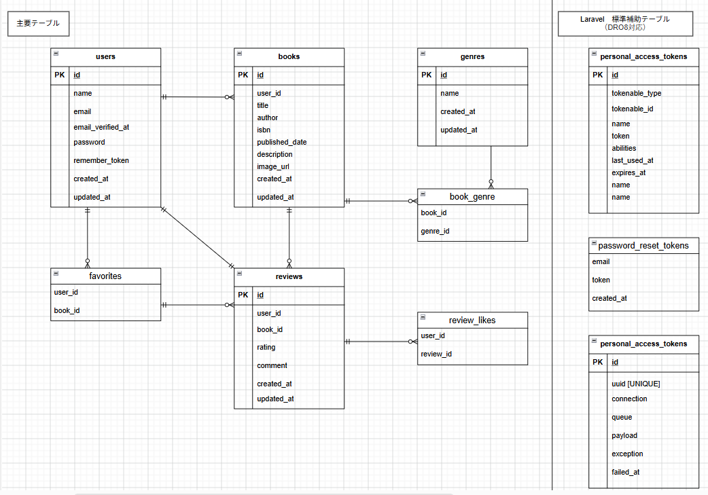

# Bookshelf App

Bookshelf Appは、書籍の登録・レビュー・お気に入り・レビューいいね・ジャンル管理・ランキング・公開APIを備えた、Laravelによる書籍レビューアプリケーションです。

単に機能を実装するだけではなく、以下を意識して設計しています。

- Controllerの責務を小さくする
- 認証・認可・バリデーションの責務を分離する
- データベース制約によってデータ整合性を保証する
- Eloquentのリレーションを活用する
- N+1問題を避ける
- Feature Test・Unit Testによって仕様やModel設計を回帰テストとして固定する
- Laravel標準の仕組みを活用し、保守しやすい構造にする

---

## 1. アプリケーション概要

ユーザーが書籍を登録し、書籍に対してレビューやお気に入り登録を行うことができます。

また、レビューへのいいね、ジャンルによる書籍分類、レビュー平均評価によるランキングを実装しています。

Web画面とは別に、書籍情報を操作するPublic APIも実装しています。

### 主な機能

- 会員登録
- ログイン
- ログアウト
- 書籍一覧
- 書籍詳細
- 書籍登録
- 書籍編集
- 書籍削除
- レビュー投稿
- レビュー編集
- レビュー削除
- お気に入り登録・解除
- お気に入り一覧
- レビューいいね登録・解除
- ジャンル登録
- ジャンル一覧
- ジャンル詳細
- ジャンル編集
- ジャンル削除
- 書籍ランキング
- Public Book API

---

## 2. 開発目的

本アプリケーションでは、Laravelを利用したWebアプリケーション開発に必要となる以下の要素を一通り実装することを目的としています。

- MVC
- 認証
- 認可
- バリデーション
- Eloquent ORM
- 1対多・多対多リレーション
- 外部キー制約
- API
- Feature Test
- Unit Test
- コード品質管理

特に、Controllerへすべての処理を記述するのではなく、Laravelが提供する仕組みを利用して責務を適切に分離することを意識しています。

---

## 3. 使用技術

| 項目 | バージョン・用途 |
| --- | --- |
| PHP | 8.2.33 |
| Laravel | 10.50.2 |
| MySQL | 8.4 |
| Laravel Sail | Docker開発環境 |
| Laravel Fortify | 認証処理 |
| Laravel Sanctum | Personal Access Token |
| Blade | Web画面 |
| Vite | フロントエンドビルド |
| Tailwind CSS | 3.4.19 |
| Alpine.js | 3.15.12 |
| @tailwindcss/forms | 0.5.11 |
| Eloquent ORM | DBアクセス・リレーション |
| FormRequest | バリデーション |
| Policy | 認可 |
| API Resource | APIレスポンス整形 |
| PHPUnit | 自動テスト |
| Laravel Pint | コードスタイル統一 |
| phpMyAdmin | DB確認 |
| Docker | 開発環境のコンテナ化 |

---

## 4. 開発環境

本プロジェクトは、要件シートで指定された初期環境構築手順に基づき、PHP 8.2 / Laravel 10.x / Laravel Sail / MySQL 8.4 の構成で開発しています。

`resources/` 配下についても、指定されたBasic版テンプレートをベースとして実装しています。

```text
Windows 11
  └─ WSL2 Ubuntu
       └─ Docker
            ├─ Laravel / PHP 8.2
            ├─ MySQL 8.4
            └─ phpMyAdmin
```

### 初期環境構築について

本プロジェクトの開発開始時には、要件シートで指定された手順に従って環境を構築しています。

初期構築の流れは以下です。

```text
Laravel 10.x プロジェクト作成
        ↓
Laravel Sail導入
        ↓
MySQL環境構築
        ↓
Vite / Tailwind CSS / Alpine.js導入
        ↓
Basic版resourcesの反映
        ↓
phpMyAdmin追加
        ↓
APP_KEY生成
        ↓
Migration / Seeder
        ↓
日本語化
```

`resources/` 配下の初期テンプレートについては、

```text
coachtech-prepared-blade-list/Preparedblade-mockcase-BookShelf
```

のBasicブランチをベースとして使用しています。

### READMEに記載する環境構築手順について

本READMEの環境構築手順は、要件シートに記載されている**初期プロジェクト作成手順を置き換えるものではありません**。

以下では、指定された環境で開発済みの本GitHubリポジトリをCloneし、同一構成で動作確認するための再構築手順を記載しています。

### Laravel Sail / Dockerを採用した理由

ローカルPCへPHPやMySQLを直接インストールする構成では、開発環境ごとの差異によって動作結果が変わる可能性があります。

Laravel SailとDockerを利用することで、以下を目的としています。

- PHPバージョンの統一
- MySQLバージョンの統一
- 開発環境の再現性確保
- ホストOSへの依存軽減
- 環境構築手順の統一

---

## 5. 環境構築

以下は、完成済みの本リポジトリをGitHubからCloneして動作確認するための手順です。

### 前提環境

以下が利用可能な環境を前提とします。

```text
Windows 11
WSL2 Ubuntu
Docker Desktop
Git
```

PHPやMySQLをホストOSへ直接インストールするのではなく、Laravel Sail / Docker上で実行します。

### 1. リポジトリをClone

```bash
git clone https://github.com/simanuki0923/bookshelf-app.git
cd bookshelf-app
```

本リポジトリは既にLaravelプロジェクトとして作成済みのため、Clone後に `composer create-project` を再実行する必要はありません。

---

### 2. Composer依存パッケージを復元

PHP 8.2用のLaravel Sail Composerコンテナを利用して、`composer.lock` に記録された依存パッケージを復元します。

```bash
docker run --rm \
-u "$(id -u):$(id -g)" \
-v "$(pwd):/var/www/html" \
-w /var/www/html \
-e COMPOSER_CACHE_DIR=/tmp/composer_cache \
laravelsail/php82-composer:latest \
composer install
```

この処理によってLaravel Sail、Fortify、Sanctum等のComposer依存パッケージが復元されます。

Clone後に以下を個別に再インストールする必要はありません。

```text
Laravel
Laravel Sail
Laravel Fortify
Laravel Sanctum
```

---

### 3. 環境変数ファイルを作成

```bash
cp .env.example .env
```

Database設定は以下を使用します。

```env
DB_CONNECTION=mysql
DB_HOST=mysql
DB_PORT=3306
DB_DATABASE=laravel
DB_USERNAME=sail
DB_PASSWORD=password
```

Laravel Sailでは `DB_HOST` に `localhost` や `127.0.0.1` ではなく、Dockerサービス名の `mysql` を指定します。

---

### 4. Laravel Sailを起動

```bash
./vendor/bin/sail up -d
```

起動状態を確認します。

```bash
./vendor/bin/sail ps
```

---

### 5. sailエイリアスを設定

以降の操作を `sail` コマンドで実行する場合は、WSL2 UbuntuのBash環境で以下を設定します。

```bash
echo "alias sail='[ -f sail ] && bash sail || bash vendor/bin/sail'" >> ~/.bashrc
source ~/.bashrc
```

確認：

```bash
sail --version
```

エイリアスを使用しない場合は、各コマンドの `sail` を `./vendor/bin/sail` に置き換えて実行できます。

---

### 6. APP_KEYを生成

```bash
sail artisan key:generate
```

---

### 7. npm依存パッケージを復元

```bash
sail npm install
```

本リポジトリには `package.json` / `package-lock.json` およびTailwind CSS / Vite等の設定ファイルが含まれているため、Clone後に以下を個別に再実行する必要はありません。

```text
npm install alpinejs
npm install tailwindcss
npm install @tailwindcss/forms
tailwindcss init
```

`npm install` によって、既に定義済みの依存関係が復元されます。

---

### 8. resourcesについて

本リポジトリの `resources/` には、指定されたBasic版テンプレートをベースとして開発・修正したファイルが含まれています。

そのため、Clone後にBasic版の `resources/` へ再度差し替える必要はありません。

再度差し替えると、本アプリケーションで実装・修正したBlade、CSS、JavaScript等が上書きされる可能性があります。

---

### 9. Databaseを構築

MigrationとSeederを実行します。

```bash
sail artisan migrate --seed
```

Databaseを完全に初期化して再構築する場合は以下を使用します。

```bash
sail artisan migrate:fresh --seed
```

---

### 10. 日本語化

本プロジェクトではLaravelのlocaleを日本語へ設定しています。

```php
'locale' => 'ja',
```

認証・バリデーション等の日本語メッセージは以下へ配置しています。

```text
lang/ja/auth.php
lang/ja/pagination.php
lang/ja/passwords.php
lang/ja/validation.php
```

本プロジェクトでは `laravel-lang/*` 系パッケージを使用せず、プロジェクト内へ日本語メッセージファイルを手動配置しています。

---

### 11. Vite開発サーバーを起動

```bash
sail npm run dev
```

開発中はこのコマンドを起動した状態にします。

---

### 12. アプリケーションへアクセス

Laravel：

```text
http://localhost
```

phpMyAdmin：

```text
http://localhost:8080
```

---

### 13. 環境確認

```bash
sail php -v
sail artisan --version
sail composer check-platform-reqs
sail artisan migrate:status
```

---

## 6. データベース構成

本アプリケーションでは、アプリケーションの主要データを管理する7テーブルと、Laravel標準の補助テーブル3テーブルを使用しています。

### 主要テーブル

```text
users
books
genres
book_genre
reviews
favorites
review_likes
```

### Laravel標準補助テーブル（DR08）

```text
password_reset_tokens
personal_access_tokens
failed_jobs
```

DR08の基本要件に基づき、Laravel標準Migrationで作成される以下の3テーブルはDatabase上に保持しています。

#### password_reset_tokens

パスワードリセット用トークンを管理するLaravel標準テーブルです。

#### personal_access_tokens

Laravel SanctumのPersonal Access Tokenを管理するLaravel標準テーブルです。

#### failed_jobs

Queue処理に失敗したJob情報を管理するLaravel標準テーブルです。

### usersテーブルの2FA関連カラム

Laravel Fortifyの標準Migrationでは、usersテーブルに以下のカラムが追加されます。

```text
two_factor_secret
two_factor_recovery_codes
two_factor_confirmed_at
```

本アプリケーションのBasic版では、

```text
会員登録
ログイン
ログアウト
```

のみを認証機能として使用し、2要素認証機能は使用しません。

そのため、上記3カラムは後続Migrationによって削除し、最終的なusersテーブルには含めない設計としています。

---

## 7. ER図

本アプリケーションのDatabase構成は以下のER図の通りです。



ER図の編集元はリポジトリ直下の `ER.drawio` です。

### 主要なリレーション

```text
users 1 : N books

users 1 : N reviews

books 1 : N reviews

books N : N genres
  └─ book_genre

users N : N books
  └─ favorites

users N : N reviews
  └─ review_likes
```

### Laravel標準補助テーブル

`personal_access_tokens` は、

```text
tokenable_type
tokenable_id
```

によるポリモーフィック関連を利用しています。

`password_reset_tokens` と `failed_jobs` は、主要7テーブルとは直接リレーションを持たないLaravel標準補助テーブルです。

---

## 8. テーブル仕様

### users

ユーザー情報を管理します。

| カラム | 型 | 制約・内容 |
| --- | --- | --- |
| id | bigint unsigned | PRIMARY KEY |
| name | varchar(255) | NOT NULL |
| email | varchar(255) | NOT NULL / UNIQUE |
| email_verified_at | timestamp | NULL許可 |
| password | varchar(255) | NOT NULL |
| remember_token | varchar(100) | NULL許可 |
| created_at | timestamp | Laravel timestamps |
| updated_at | timestamp | Laravel timestamps |

`email` にはUNIQUE制約を設定しています。

本アプリケーションでは2要素認証を使用しないため、

```text
two_factor_secret
two_factor_recovery_codes
two_factor_confirmed_at
```

は最終的なusersテーブルには保持しません。

---

### books

登録された書籍情報を管理します。

| カラム | 型 | 制約・内容 |
| --- | --- | --- |
| id | bigint unsigned | PRIMARY KEY |
| user_id | bigint unsigned | NOT NULL / FOREIGN KEY → users.id |
| title | varchar(255) | NOT NULL |
| author | varchar(255) | NOT NULL |
| isbn | char(13) | NOT NULL / UNIQUE |
| published_date | date | NOT NULL |
| description | text | NULL許可 |
| image_url | varchar(255) | NULL許可 |
| created_at | timestamp | Laravel timestamps |
| updated_at | timestamp | Laravel timestamps |

`user_id` は書籍を登録したユーザーを表します。

ユーザー削除時には、そのユーザーが登録した書籍も削除されるよう外部キーへCascade Deleteを設定しています。

ISBNは13桁とし、重複登録を防止するため `isbn` にUNIQUE制約を設定しています。

---

### genres

書籍を分類するジャンルを管理します。

| カラム | 型 | 制約・内容 |
| --- | --- | --- |
| id | bigint unsigned | PRIMARY KEY |
| name | varchar(255) | NOT NULL / UNIQUE |
| created_at | timestamp | Laravel timestamps |
| updated_at | timestamp | Laravel timestamps |

同一ジャンル名の重複登録を防止するため、`name` にUNIQUE制約を設定しています。

---

### book_genre

BookとGenreの多対多関係を管理する中間テーブルです。

| カラム | 型 | 制約・内容 |
| --- | --- | --- |
| book_id | bigint unsigned | PRIMARY KEY（複合） / FOREIGN KEY → books.id |
| genre_id | bigint unsigned | PRIMARY KEY（複合） / FOREIGN KEY → genres.id |

```text
book_id + genre_id
```

を複合主キーとしています。

これにより、同一書籍へ同じジャンルが重複して登録されることをDatabaseレベルで防止しています。

`book_id` はBook削除時に関連を削除するためCascade Delete、`genre_id` は利用中Genreの削除を防ぐためRestrict Deleteとしています。

---

### reviews

書籍へ投稿されたレビューを管理します。

| カラム | 型 | 制約・内容 |
| --- | --- | --- |
| id | bigint unsigned | PRIMARY KEY |
| user_id | bigint unsigned | NOT NULL / FOREIGN KEY → users.id |
| book_id | bigint unsigned | NOT NULL / FOREIGN KEY → books.id |
| rating | tinyint unsigned | NOT NULL / 1〜5 |
| comment | text | NOT NULL |
| created_at | timestamp | Laravel timestamps |
| updated_at | timestamp | Laravel timestamps |

`rating` は1〜5の範囲で必須です。

`comment` も必須とし、Validationでは最大1000文字としています。

`reviews` では、

```text
user_id + book_id
```

にUNIQUE制約を設定していません。

これは、同一ユーザーが同一書籍へ複数回レビューを投稿できる仕様に対応するためです。

`user_id` と `book_id` はともにCascade Deleteとしています。

---

### favorites

ユーザーのお気に入り書籍を管理する中間テーブルです。

| カラム | 型 | 制約・内容 |
| --- | --- | --- |
| user_id | bigint unsigned | PRIMARY KEY（複合） / FOREIGN KEY → users.id |
| book_id | bigint unsigned | PRIMARY KEY（複合） / FOREIGN KEY → books.id |

```text
user_id + book_id
```

を複合主キーとしています。

これにより、同一ユーザーによる同一書籍への重複お気に入り登録をDatabaseレベルで防止しています。

両方の外部キーにCascade Deleteを設定しています。

---

### review_likes

レビューに対するいいねを管理する中間テーブルです。

| カラム | 型 | 制約・内容 |
| --- | --- | --- |
| user_id | bigint unsigned | PRIMARY KEY（複合） / FOREIGN KEY → users.id |
| review_id | bigint unsigned | PRIMARY KEY（複合） / FOREIGN KEY → reviews.id |

```text
user_id + review_id
```

を複合主キーとしています。

これにより、同一ユーザーによる同一レビューへの重複いいねをDatabaseレベルで防止しています。

両方の外部キーにCascade Deleteを設定しています。

---

### password_reset_tokens

Laravel標準のパスワードリセット用補助テーブルです。

| カラム | 型 | 制約・内容 |
| --- | --- | --- |
| email | varchar(255) | PRIMARY KEY |
| token | varchar(255) | NOT NULL |
| created_at | timestamp | NULL許可 |

Basic版ではパスワードリセット機能自体は提供していませんが、DR08の基本要件としてLaravel標準Migrationの構成を保持しています。

---

### personal_access_tokens

Laravel SanctumがPersonal Access Tokenを管理するための標準テーブルです。

| カラム | 型 | 制約・内容 |
| --- | --- | --- |
| id | bigint unsigned | PRIMARY KEY |
| tokenable_type | varchar(255) | NOT NULL / INDEX |
| tokenable_id | bigint unsigned | NOT NULL / INDEX |
| name | varchar(255) | NOT NULL |
| token | varchar(64) | NOT NULL / UNIQUE |
| abilities | text | NULL許可 |
| last_used_at | timestamp | NULL許可 |
| expires_at | timestamp | NULL許可 |
| created_at | timestamp | NULL許可 / Laravel timestamps |
| updated_at | timestamp | NULL許可 / Laravel timestamps |

`tokenable_type` と `tokenable_id` によるポリモーフィック関連を利用しています。

`User` モデルではLaravel Sanctumの `HasApiTokens` Traitを使用しています。

---

### failed_jobs

Laravel Queueで処理に失敗したJobを記録する標準補助テーブルです。

| カラム | 型 | 制約・内容 |
| --- | --- | --- |
| id | bigint unsigned | PRIMARY KEY |
| uuid | varchar(255) | NOT NULL / UNIQUE |
| connection | text | NOT NULL |
| queue | text | NOT NULL |
| payload | longtext | NOT NULL |
| exception | longtext | NOT NULL |
| failed_at | timestamp | NOT NULL / CURRENT_TIMESTAMP |

現在のアプリケーション機能から直接利用しているテーブルではありませんが、DR08の基本要件としてLaravel標準Migrationの構成を保持しています。

---

## 9. Eloquentリレーション設計

モデル間の関連はEloquent ORMで定義しています。

### User

```text
User
├─ hasMany Books
├─ hasMany Reviews
├─ belongsToMany FavoriteBooks
└─ belongsToMany LikedReviews
```

### Book

```text
Book
├─ belongsTo User
├─ belongsToMany Genres
├─ hasMany Reviews
└─ belongsToMany FavoritedByUsers
```

### Genre

```text
Genre
└─ belongsToMany Books
```

### Review

```text
Review
├─ belongsTo User
├─ belongsTo Book
└─ belongsToMany LikedByUsers
```

### personal_access_tokens

`personal_access_tokens` は通常の外部キーによる関連ではなく、

```text
tokenable_type
tokenable_id
```

によるポリモーフィック関連を使用します。

UserモデルではLaravel Sanctumの `HasApiTokens` Traitを使用しています。

### password_reset_tokens / failed_jobs

以下の2テーブルについては、主要ModelとのEloquentリレーションを定義していません。

```text
password_reset_tokens
failed_jobs
```

Laravel標準機能を支える補助テーブルとして管理しています。

### Eloquentを採用した理由

ControllerでSQLやJOINを直接記述するのではなく、Modelへリレーションを定義することで以下を目的としています。

- データ構造をModelから把握しやすくする
- ControllerのDB処理を簡潔にする
- Laravel標準の記述方法へ統一する
- 関連データ取得を再利用しやすくする
- モデル間の責務を明確にする

---

## 10. 認証・認可設計

### 認証

認証にはLaravel Fortifyを使用しています。

Basic機能として以下を実装しています。

- 会員登録
- ログイン
- ログアウト

Fortifyの追加機能であるパスワードリセット・メール認証・2要素認証などは、Basic版では使用していません。

### Fortifyを採用した理由

認証を独自実装すると、Password Hash、Session、CSRF、ログイン状態など、多くのセキュリティ要素を個別に考慮する必要があります。

Laravel Fortifyを利用することで、Laravel標準の認証機構を使用しつつ、Bladeによる画面表示と認証処理の責務を分離しています。

これにより、認証処理の安全性・保守性を高めています。

### 認可

書籍とレビューの編集・削除にはLaravel Policyを使用しています。

```text
BookPolicy
ReviewPolicy
```

#### BookPolicy

書籍の編集・削除は、書籍登録者本人のみ許可します。

権限のないユーザーによる操作にはHTTP 403を返します。

#### ReviewPolicy

レビューの編集・削除は、レビュー投稿者本人のみ許可します。

権限のないユーザーによる操作にはHTTP 403を返します。

### Policyを採用した理由

Controllerへ以下のような認可判定を繰り返し記述すると、Controllerの責務が増え、認可処理が複数箇所へ分散します。

```php
if ($book->user_id !== auth()->id()) {
    abort(403);
}
```

Policyへ認可処理を分離することで、以下を目的としています。

- Controllerを簡潔に保つ
- 認可ルールを一箇所へ集約する
- 認可仕様変更時の修正範囲を減らす
- 不正な編集・削除を防止する

---

## 11. バリデーション設計

入力値のValidationにはLaravel FormRequestを使用しています。

主なRequestクラスは以下です。

```text
StoreBookRequest
UpdateBookRequest
StoreReviewRequest
UpdateReviewRequest
StoreGenreRequest
UpdateGenreRequest
Auth/LoginRequest

Api/V1/ListBooksRequest
Api/V1/StoreBookRequest
Api/V1/UpdateBookRequest
```

Validation Errorのメッセージは日本語で表示します。

### 書籍

```text
title
required / string / max:255

author
required / string / max:255

isbn
required / digits:13 / unique

published_date
required / date

description
nullable / string

image_url
nullable / url / max:255

genres
required / array / min:1
```

ISBNはハイフンなしの13桁で検証します。

`genres` 配列については、同一Genre IDの重複自体はValidation Errorとはしません。

### レビュー

```text
rating
required / integer / min:1 / max:5

comment
required / string / max:1000
```

### ジャンル

```text
name
required / string / max:255 / unique
```

更新時は現在のジャンル自身をUNIQUE判定から除外します。

### API書籍一覧

```text
keyword
nullable / string / max:255

genre_id
nullable / integer / exists:genres,id

page
nullable / integer / min:1

per_page
nullable / integer / min:1 / max:100
```

### FormRequestを採用した理由

ValidationをFormRequestへ分離することで、Controllerを処理の組み立てとレスポンス制御へ集中させています。

---

## 12. 各機能の設計背景

### 書籍機能

書籍には登録ユーザーを示す `user_id` を保持しています。

```text
登録ユーザー本人
├─ 編集可能
└─ 削除可能

その他のユーザー
├─ 編集不可
└─ 削除不可
```

書籍一覧は新しい書籍から表示し、10件単位でPaginationしています。

### レビュー機能

レビューには以下を保持しています。

```text
user_id
book_id
rating
comment
```

`rating` は1〜5、`comment` は必須です。

同一ユーザーが同一書籍へ複数レビューを投稿できる仕様のため、

```text
user_id + book_id
```

にはUNIQUE制約を設定していません。

また、書籍登録者本人が自分で登録した書籍へレビューを投稿することも可能です。

### お気に入り機能

ユーザーと書籍は多対多関係になるため、`favorites` 中間テーブルを利用しています。

`user_id + book_id` を複合主キーにすることで、Application側だけでなくDatabase側でも重複登録を防止しています。

ユーザーは、自分自身が登録した書籍もお気に入り登録できます。

お気に入り一覧はBookの `created_at` の降順で表示します。

### レビューいいね機能

レビューいいねには `review_likes` 中間テーブルを使用しています。

```text
User
  ↓
review_likes
  ↓
Review
```

登録・解除にはEloquentの `toggle()` を利用しています。

```text
未登録
  ↓
いいね登録

登録済み
  ↓
いいね解除
```

レビュー投稿者本人も自分のレビューへいいねできます。

### ジャンル機能

BookとGenreは多対多関係です。

```text
Book
  ↓
book_genre
  ↓
Genre
```

書籍から利用されているGenreは削除できないよう制御しています。

利用中のGenreを削除しようとした場合は、

```text
このジャンルには書籍が紐付いているため削除できません。
```

と表示します。

ジャンル一覧はジャンル名順、ジャンル別書籍一覧はBookの `created_at` の降順で表示します。

### ランキング機能

レビュー平均評価が高い書籍から順番に最大10件表示します。

レビューが存在しない書籍はランキング対象外です。

平均評価やレビュー件数には、

```text
withAvg()
withCount()
```

を利用しています。

---

## 13. データ整合性設計

外部キー制約とCascade / Restrictを利用し、削除処理後に不整合データが残らないよう設計しています。

### Book削除時

```text
Book
├─ Reviews      → 削除
├─ Favorites    → 削除
├─ book_genre   → 関連削除
└─ Genres       → 削除しない
```

### Review削除時

```text
Review
└─ ReviewLikes → 削除
```

### 中間テーブルの複合主キー

```text
book_genre
  book_id + genre_id

favorites
  user_id + book_id

review_likes
  user_id + review_id
```

Application側だけでなく、Database側でも同一組み合わせの重複登録を防止しています。

---

## 14. パフォーマンス設計

### N+1問題への対応

以下を利用しています。

```text
with()
load()
withAvg()
withCount()
```

必要な関連情報を事前にまとめて取得することで、SQL発行回数を抑えています。

### Pagination

以下の一覧では10件単位のPaginationを使用しています。

- 書籍一覧
- お気に入り一覧
- ジャンル別書籍一覧

Public APIは、

```text
default per_page = 20
max per_page = 100
```

としています。

---

## 15. Public API

Basic版のPublic APIは認証不要です。

### エンドポイント

| Method | URI | 内容 | 認証 |
| --- | --- | --- | --- |
| GET | `/api/v1/books` | 書籍一覧 | 不要 |
| POST | `/api/v1/books` | 書籍登録 | 不要 |
| GET | `/api/v1/books/{book}` | 書籍詳細 | 不要 |
| PUT | `/api/v1/books/{book}` | 書籍更新 | 不要 |
| DELETE | `/api/v1/books/{book}` | 書籍削除 | 不要 |

### 一覧検索パラメータ

| パラメータ | 内容 |
| --- | --- |
| keyword | title / author 部分一致 |
| genre_id | Genre ID |
| page | ページ番号 |
| per_page | 1ページの件数 |

`per_page` の標準値は20、最大100です。

一覧は `created_at DESC` の最新順です。

範囲外ページは、

```text
HTTP 200
data: []
links: ...
meta: ...
```

を返します。

### 書籍登録時のuser_id

Public APIは認証不要のため、書籍登録者はRequestから受け取る `user_id` によって指定します。

---

## 16. API Resource

```text
BookResource
ReviewResource
```

### BookResource

基本レスポンス：

```text
id
title
author
isbn
published_date
description
image_url
genres
average_rating
review_count
```

以下は含めません。

```text
user_id
created_at
updated_at
```

書籍詳細では `reviews` を追加します。

レビューが存在しない場合、

```json
{
    "average_rating": null
}
```

となります。

平均評価が存在する場合は小数第1位まで返します。

### ReviewResource

```text
id
user_name
rating
comment
created_at
```

---

## 17. APIレスポンス

```text
GET     200 OK
POST    201 Created
PUT     200 OK
DELETE  204 No Content
```

存在しないBook：

```json
{
    "error": "書籍が見つかりませんでした。"
}
```

Validation Error：

```json
{
    "message": "...",
    "errors": {
        "field": [
            "..."
        ]
    }
}
```

---

## 18. Controllerの責務

```text
Controller
→ 処理の組み立て・レスポンス

FormRequest
→ Validation

Policy
→ Authorization

Model
→ Relation / Data Access

API Resource
→ API Response
```

Laravelの標準機能へ責務を分離し、Controllerを簡潔に保つことを意識しています。

---

## 19. テスト方針

Feature TestとModel Unit Testを実装しています。

### Unit Test

```text
Tests/Unit/Models/UserTest
Tests/Unit/Models/BookTest
Tests/Unit/Models/GenreTest
Tests/Unit/Models/ReviewTest
```

### 主なFeature Test

```text
AuthenticationTest
BasicWebTest

BookCreateTest
BookIndexTest
BookShowTest
BookUpdateTest
BookDeleteTest

ReviewCreateTest
ReviewUpdateTest
ReviewDeleteTest
ReviewLikeTest

FavoriteToggleTest
FavoriteIndexTest

GenreCreateTest
GenreIndexTest
GenreShowTest
GenreUpdateTest
GenreDeleteTest

RankingTest

Api/BookApiTest
```

### 主な固定仕様

```text
same user can create multiple reviews for same book

user can like own review

user can favorite own book

user can review own book

reviews are deleted with book

favorites are deleted with book

book genre relationships are deleted with book

genres are not deleted with book

favorite books are displayed in latest book order

genre books are displayed in latest book order

out of range page returns empty data
```

### 現在のテスト結果

```text
Tests:      230 passed
Assertions: 725
Coverage:   92.5%
```

### Test実行

```bash
sail artisan test
```

### Unit Test

```bash
sail artisan test tests/Unit
```

### Coverage

```bash
sail artisan test --coverage
```

---

## 20. コード品質

Laravel Pintを使用しています。

### 確認

```bash
sail bin pint --test
```

現在：

```text
122 files PASS
```

### 自動修正

```bash
sail bin pint
```

---

## 21. Migration設計

確認：

```bash
sail artisan migrate:status
```

### Review commentの必須化

```text
make_comment_required_on_reviews_table
```

後続Migrationによって `comment` をNOT NULLへ変更しています。

### DR08標準テーブル

```text
password_reset_tokens
personal_access_tokens
failed_jobs
```

はLaravel標準Migrationの構成を保持しています。

### usersの2FA関連カラム

```text
two_factor_secret
two_factor_recovery_codes
two_factor_confirmed_at
```

はBasic版では使用しないため、

```text
remove_unused_two_factor_columns_from_users_table
```

によって削除しています。

DR08の標準補助テーブルは削除していません。

### migrate:fresh時

```bash
sail artisan migrate:fresh --seed
```

を実行した場合にも、

```text
password_reset_tokens
personal_access_tokens
failed_jobs
```

が作成され、不要な2FA関連カラムのみ最終的に削除されます。

---

## 22. 主なルーティング

### Public

```text
GET /
GET /books/{book}
GET /ranking
```

### Authentication

```text
GET  /register
POST /register
GET  /login
POST /login
POST /logout
```

### Books

```text
GET    /books/create
POST   /books
GET    /books/{book}
GET    /books/{book}/edit
PUT    /books/{book}
DELETE /books/{book}
```

### Reviews

```text
POST   /books/{book}/reviews
GET    /reviews/{review}/edit
PUT    /reviews/{review}
DELETE /reviews/{review}
```

### Favorites

```text
GET  /favorites
POST /books/{book}/favorites
```

### Review Likes

```text
POST /reviews/{review}/like
```

### Genres

```text
GET    /genres
GET    /genres/create
POST   /genres
GET    /genres/{genre}
GET    /genres/{genre}/edit
PUT    /genres/{genre}
DELETE /genres/{genre}
```

### Public API

```text
GET    /api/v1/books
POST   /api/v1/books
GET    /api/v1/books/{book}
PUT    /api/v1/books/{book}
DELETE /api/v1/books/{book}
```

---

## 23. 開発時の確認コマンド

### PHP

```bash
sail php -v
```

### Laravel

```bash
sail artisan --version
```

### Composer

```bash
sail composer check-platform-reqs
```

### Migration

```bash
sail artisan migrate:status
```

### Route

```bash
sail artisan route:list
```

### Pint

```bash
sail bin pint --test
```

### Test

```bash
sail artisan test
```

### Unit Test

```bash
sail artisan test tests/Unit
```

### Coverage

```bash
sail artisan test --coverage
```

---

## 24. 設計上意識したポイント

### 責務を分離する

```text
Controller
→ Application処理

FormRequest
→ Validation

Policy
→ Authorization

Model
→ Relation / Data Access

API Resource
→ API Response
```

### DBで保証できるものはDBでも保証する

```text
ISBN
→ UNIQUE

お気に入り
→ user_id + book_id

レビューいいね
→ user_id + review_id

書籍 × ジャンル
→ book_id + genre_id
```

### 関連データの整合性

外部キー制約とCascade / Restrictを利用しています。

### パフォーマンス

```text
Eager Loading
Pagination
DB集計
```

を利用しています。

### 仕様をテストとして残す

重要な仕様をFeature Testとして固定しています。

ModelのリレーションやCastについてはUnit Testとして固定しています。

---

## 25. 作成者

島貫 守

---

## 26. まとめ

Bookshelf Appでは、単純にCRUDを実装するだけではなく、Laravelの各機能を役割ごとに分けて利用しています。

```text
Fortify
→ Authentication

Policy
→ Authorization

FormRequest
→ Validation

Eloquent ORM
→ Relation / Data Access

API Resource
→ API Response

Migration / Foreign Key
→ Database Integrity

Eager Loading
→ N+1対策

Pagination
→ 大量データ対策

PHPUnit Feature Test
→ Specification / Regression Test

PHPUnit Unit Test
→ Model Relation / Cast Test

Laravel Pint
→ Code Quality
```

機能が動作することだけでなく、

**「なぜその実装方法を選択したのか」**

を意識し、保守性・データ整合性・パフォーマンス・テスト容易性を考慮した設計を行っています。